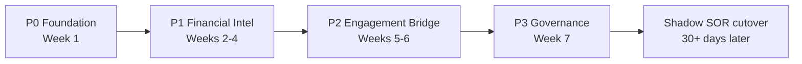

# NR2 Cloud PMS Augmentation Plan

**Date:** 2026-07-16  
**Basis:** [MOONSHOT_CLOUD_PMS_PARITY_2026-07-16.md](./MOONSHOT_CLOUD_PMS_PARITY_2026-07-16.md)  
**Build:** `nr2-12073-excel-gate-all-next`  
**Status:** PLAN ONLY — no code applied until operator approves per phase.

---

## North star

NR2 becomes the **financial intelligence overlay** on SoftDent + QuickBooks — comparable to the **admin/finance/analytics** layers of Curve Hero and Dentrix Ascend, **not** a clinical PMS replacement.

| Layer | Owner | NR2 role |
|-------|-------|----------|
| Clinical (chart, schedule, eRx, imaging) | SoftDent desktop | Read-only ingest only |
| Financial SOR (shadow → cutover) | NR2 | Period-close, beams, reconciliation |
| GL / payroll | QuickBooks | CSV/cache import |
| Eligibility | Trellis (Vyne) | Nightly scrape + AM proof |
| Patient engagement (optional) | Lighthouse 360 | Bridge from NR2 recall lists |
| Clinical KPIs (optional) | Jarvis Analytics OR NR2 analytics page | Only if P1 dashboards insufficient |

**Hard rules (never violate):** SoftDent write-back forbidden · empty ≠ $0 · Excel/Print Preview only · no third-party chat embeds · PHI initials+hash on boards.

---

## Current baseline (2026-07-16 live)

| Capability | State |
|------------|-------|
| Money beams | LIVE — SD $60,411 · QB $78,399 |
| Import readiness | GREEN · 17/19 connected · 2 optional QB stale |
| Period close | Shadow completed · `systemOfRecord=false` |
| Desk smoke | RED — `beam_desk_proof` MISMATCH |
| Morning bundle | Excel gate documented · `morningBundle` attest path |
| Claims optical page | Wired — list, filters, age colors, dossier |
| OM schedule / Trellis huddle | Shipped on optical OM page |
| HAL patient context | Shipped |
| ERA inbox APIs | Present · apex pack stubs removed |
| Analytics / morning huddle page | **Missing** |
| Lighthouse bridge | **Missing** |
| `morning_bundle_attended.py` | **Missing** (referenced in docs only) |

---

## Phase map (7 weeks)

---

## P0 — Foundation hardening (Week 1)

**Goal:** Trustworthy daily money path before feature expansion.

### P0.1 SoftDent Excel enablement (operator-attended)

| Item | Detail |
|------|--------|
| Runbook | `NewRidgeFinancial2/docs/runbooks/softdent_excel_enablement_nr2.md` |
| Policy | `NewRidgeFinancial2/softdent_report_pull.py` · HAL `GET /api/apex/hal/softdent-report-pull` |
| Bundle logic | `NewRidgeFinancial2/hal_brain_tools.py` → `softdent_export_morning_bundle` |
| Schedule | 9:00 PM local night-before for aging + register + collections |

**Tasks:**
1. Operator: confirm Excel not greyed on Output Options (screenshot).
2. Operator: save once to SoftDent’s own Documents folder (never invent `C:\SoftDentReportExports` in SoftDent UI).
3. Dev: add `scripts/morning_bundle_attended.py` — thin CLI wrapping `softdent_export_morning_bundle` with attended prompts + JSON log.
4. Re-run bundle; gate `periodClose.morningBundle.ok === true` and files under ingest paths.

**Validation gate:** Three Excel exports (aging, register, collections) with non-zero rows · `moneyBeamIngest: true` on each · `emptyNotZero` preserved.

### P0.2 Desk smoke / beam proof repair

| Item | Detail |
|------|--------|
| Existing | `NewRidgeFinancial2/desk_smoke.py` · `scripts/desk_ops_smoke.py` |
| UI | Hub `btn-verify-beam` · `btn-desk-smoke` in `nr2-optical-pages-hub.html` |
| API | `GET /api/health/desk-smoke` · money beams `dataBeamHash` |

**Tasks:**
1. Diagnose `beam_desk_proof` MISMATCH (live hash vs period-close snapshot).
2. Ensure VERIFY BEAM route returns 200 (fix 404 if still present).
3. Optional: scheduled task running `desk_ops_smoke.py` every 5 min → `logs/desk_smoke.jsonl`.
4. Gate: 24h consecutive GREEN or documented honest RED with cause.

**Validation gate:** `deskProof: MATCH` · `forceCloseAvailable` only when money + lasers agree (not smoke alone).

### P0.3 QB optional hygiene

| Item | Detail |
|------|--------|
| Runbook | `NewRidgeFinancial2/docs/runbooks/qb_ap_payroll_inbox_drop_nr2.md` |
| Stale | `quickbooks.ap` · `quickbooks.payroll` (~44h old, optional) |

**Tasks:** Staff CSV drop when bandwidth allows — does not block P1.

**P0 exit criteria:** Morning bundle OK · desk smoke MATCH · money beams fresh (&lt;24h).

---

## P1 — Financial intelligence layer (Weeks 2–4)

**Goal:** Jarvis/Ascend-style ops dashboards without leaving NR2.

### P1.1 Trellis eligibility automation

| Item | Detail |
|------|--------|
| Nightly | `scripts/run_trellis_nightly_verify.py` · `scripts/install_trellis_nightly_verify_task.ps1` |
| AM proof | `scripts/prove_trellis_withbenefits_am.py` |
| Report build | `NewRidgeFinancial2/scripts/build_trellis_eligibility_report.py` |
| OM surface | Trellis block on `nr2-optical-page-office-manager.html` |

**Tasks:**
1. Confirm 10:10 PM task registered (after 9 PM SoftDent pull).
2. AM: run `prove_trellis_withbenefits_am.py` — exit 0 when `withBenefits > 0`.
3. Surface eligibility summary on OM page from live report JSON (already partial).

**Validation gate:** 3 consecutive weekdays with `withBenefits > 0`.

### P1.2 Claims intelligence (extend existing page)

| Item | Detail |
|------|--------|
| Page | `site/nr2-optical-page-claims.html` + `nr2-optical-page-claims.js` |
| API | `GET /api/softdent/claims-outstanding` |
| DB | `C:\SoftDentFinancialExports\softdent_financial_analytics.db` (when populated) |

**Tasks:**
1. Wire ERA face on claims page to `GET /api/apex/hal/era-inbox/status` (read-only counts).
2. Add payer-batch export (CSV initials+hash) for phone follow-up — no auto-dialer.
3. Link claim row → HAL patient summary (`this-patient` pattern already on desk).
4. Denials/flagged counts from status field — ∅ when none.

**Validation gate:** Staff completes one payer batch from Claims page without opening SoftDent Insurance Reports.

### P1.3 ERA → QB suggestion lane (read-only)

| Item | Detail |
|------|--------|
| Parser | `NewRidgeFinancial2/era835_parser.py` (exists) |
| APIs | `/api/apex/hal/era-inbox/*` · `nr2_browser_security.py` mutation contract |
| Inbox | `app_data/nr2/office/era_inbox/` |

**Tasks:**
1. Restore ingest path without deleted `apex_era835_pack` — use `era835_parser` + local inbox only.
2. New endpoint: `GET /api/nr2/era/suggestions` — matched payments, operator approves in QB manually.
3. Claims page ERA tile shows inbox count + last ingest — ∅ not $0.

**Validation gate:** One 835 file ingested · suggestion row appears · no auto-post to QB.

### P1.4 Analytics / Morning Huddle page (new)

| Item | Detail |
|------|--------|
| New files | `site/nr2-optical-page-analytics.html` · `nr2-optical-page-analytics.js` |
| Hub link | Add to `nr2-optical-pages-hub.html` mode strip |
| Data sources | Money beams · morning bundle status · QB revenue · SD register/aging ingest · Trellis summary |

**Dashboard modules (Jarvis-parity subset):**

| Module | Source | Cloud analog |
|--------|--------|--------------|
| Morning Huddle | SD register + schedule OM | Jarvis Morning Huddle |
| End of Day | Money beams + period close | Jarvis End of Day |
| Production MTD | QB revenue + SD collections | Jarvis Dashboard |
| Claims aging bands | Claims outstanding API | Ascend unsent/unresolved |
| Eligibility today | Trellis report | Ascend Eligibility Pro |
| Hygiene recall gap | SD recare export (when Excel live) | Jarvis Hygiene Recall |

**Validation gate:** OM runs morning huddle from Analytics page in &lt;5 min without Excel on desk.

**P1 exit criteria:** Analytics page live · Trellis AM proof 3-day streak · ERA inbox wired · claims batch workflow proven.

---

## P2 — Patient engagement bridge (Weeks 5–6)

**Goal:** Lighthouse 360 for texting/reminders — NR2 stays financial brain.

### P2.1 Lighthouse evaluation (operator decision)

| Option | When |
|--------|------|
| Subscribe Lighthouse 360 | Want turnkey texting, forms, reviews (SoftDent listed on lh360.com supported platforms) |
| Skip | HAL copy-paste narratives sufficient for now |

**Do not build:** NR2-native two-way SMS UI (wrong layer · PHI · embed rules).

### P2.2 Financial recall export

**Tasks:**
1. Config template: `app_data/nr2/office/lighthouse_config.yaml.example` (no secrets in repo).
2. Query: patients with outstanding &gt;$X + last visit &gt;Y months from SD analytics DB.
3. Export CSV: initials + hash + phone last-4 + balance band (board-safe).
4. HAL template: `format_financial_recall_hal_reply` for staff paste into Lighthouse.

**Validation gate:** Staff generates recall list in NR2 → imports or syncs to Lighthouse without SoftDent Insurance UI.

### P2.3 HAL financial messaging

**Tasks:**
1. Extend HAL policies for “patient balance narrative” using live claims row only.
2. Gate money answers on `GET /api/hal/tools/money-beams` prompt block (already exists).

**P2 exit criteria:** One financial recall campaign sourced from NR2 data.

---

## P3 — Governance & architecture (Week 7)

**Goal:** Document the hybrid model for compliance and future DSO scale.

### P3.1 Architecture doc

**New:** `NewRidgeFinancial2/docs/architecture/hybrid_pms_overlay.md`

Contents:
- SoftDent = clinical SOR
- NR2 = financial shadow SOR (`systemOfRecord=false` until attestation)
- QB = GL
- Optional Lighthouse / Jarvis roles
- Data flow diagram
- What NR2 will never write to SoftDent

### P3.2 Cutover runbook

**New:** `NewRidgeFinancial2/docs/runbooks/nr2_cutover_to_sor.md`

Phases: shadow (30d min) → supervised → operator attestation → `systemOfRecord=true`

Tied to: `pilot` block in `/api/app-info` · `forceCloseAvailable` laser gates.

### P3.3 Capability parity scorecard

Maintain checklist against 10 cloud pillars (from Moonshot matrix) — quarterly review.

**P3 exit criteria:** Docs signed · parity scorecard baseline recorded.

---

## Explicitly out of scope (all phases)

- SoftDent write-back (payments, patients, adjustments, claims submit)
- Clinical charting, perio UI, imaging PACS, eRx
- Treatment planning / case presentation UI
- Online scheduling widget in NR2
- Native card processing / Curve Pay clone
- Third-party chat embeds (Tawk, PushEngage, etc.)
- Replacing SoftDent with Dentrix Ascend or Curve Hero

---

## Work package summary

| ID | Package | Effort | Owner | Depends |
|----|---------|--------|-------|---------|
| P0.1 | Excel enablement + morning bundle | S (operator) + S (script) | Operator + Dev | — |
| P0.2 | Desk smoke / beam MATCH | S | Dev | P0.1 partial |
| P0.3 | QB CSV drop | XS | Staff | — |
| P1.1 | Trellis schedule + AM proof | S | Dev + Ops | P0.1 |
| P1.2 | Claims intelligence polish | M | Dev | P0.1 |
| P1.3 | ERA suggestion lane | M | Dev | P1.2 |
| P1.4 | Analytics / huddle page | L | Dev | P0.1, P1.1 |
| P2.1 | Lighthouse decision | XS | Operator | P1.4 |
| P2.2 | Financial recall export | M | Dev | P1.2, P2.1 |
| P2.3 | HAL financial narratives | S | Dev | P1.2 |
| P3.1 | Architecture doc | S | Dev | P1 complete |
| P3.2 | Cutover runbook | S | Dev + Operator | P3.1 |
| P3.3 | Parity scorecard | XS | Dev | P3.1 |

**Effort key:** XS &lt;4h · S 1–2d · M 3–5d · L 1–2w

---

## Recommended execution order (sprints)

### Sprint 1 (this week) — unblock money
1. P0.1 operator Excel session
2. P0.2 beam mismatch fix
3. Ship `morning_bundle_attended.py`

### Sprint 2 — claims + trellis
1. P1.1 Trellis task + AM proof
2. P1.2 claims ERA tile + payer batch

### Sprint 3 — analytics face
1. P1.4 analytics page MVP (3 modules: huddle, MTD, claims aging)
2. P1.3 ERA ingest restore

### Sprint 4 — engagement optional
1. P2.1 Lighthouse decision
2. P2.2 + P2.3 if yes

### Sprint 5 — govern
1. P3.1–P3.3 docs
2. Begin 30-day shadow clock toward cutover attestation

---

## Success metrics (cloud parity scorecard)

| Metric | Target | Measure |
|--------|--------|---------|
| Morning bundle success rate | ≥95% weekdays | `morningBundle.ok` |
| Money beam freshness | &lt;24h | `importReadiness` |
| Desk smoke MATCH | ≥95% | `/api/health/desk-smoke` |
| Trellis withBenefits | &gt;0 on clinic days | `prove_trellis_withbenefits_am.py` |
| Claims workflow | &lt;2 min payer batch | Staff timed test |
| Morning huddle time | &lt;5 min | Analytics page |
| HAL money honesty | 0 invented $ | Audit HAL vs beams |
| Shadow days | ≥30 before cutover | `pilot.shadowDaysElapsed` |

---

## Operator decisions needed

1. **P0:** Schedule attended Excel enablement session (10–15 min).
2. **P2:** Subscribe to Lighthouse 360 or defer engagement bridge.
3. **P1/P3:** Build NR2 analytics vs subscribe Jarvis for clinical KPIs.
4. **Cutover:** Target date for `systemOfRecord=true` attestation (≥30 days shadow after P1 complete).

---

## Approval to start

- [ ] Operator approves P0 (Excel + desk smoke) — say **continue P0**
- [ ] Operator approves full plan or requests trim (e.g. skip P2 Lighthouse)
- [ ] No clinical PMS features expected from NR2

**Next action when approved:** Execute P0.1 attended Excel gate per runbook, then P0.2 beam MATCH diagnosis.
