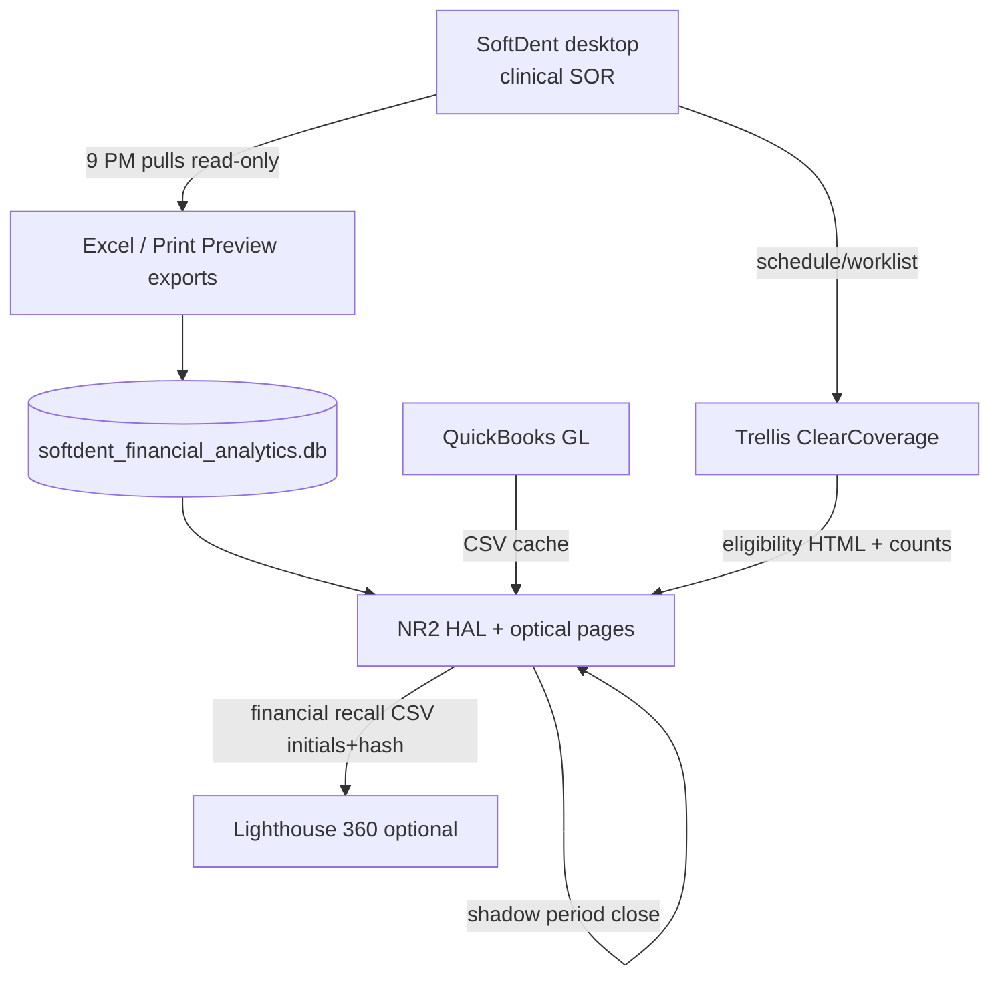

# Hybrid PMS overlay architecture

**Date:** 2026-07-16  
**Build:** `nr2-12073-excel-gate-all-next`  
**Status:** Shadow financial SOR — `systemOfRecord=false` until cutover attestation.

---

## North star

NR2 is the **financial intelligence overlay** on SoftDent + QuickBooks. It targets **admin, finance, claims, and analytics** parity with Curve Hero / Dentrix Ascend — **not** clinical PMS replacement.

| Layer | System of record | NR2 role |
|-------|------------------|----------|
| Clinical (chart, schedule, eRx, imaging) | **SoftDent desktop** | Read-only ingest (Excel / Print Preview only) |
| Financial shadow → cutover | **NR2** | Period close, money beams, desk smoke, claims intelligence |
| General ledger | **QuickBooks** | CSV/cache import; manual ERA approval |
| Eligibility | **Trellis (Vyne)** | Nightly scrape + AM `withBenefits` proof |
| Patient engagement (optional) | **Lighthouse 360** | CSV bridge from NR2 recall export — no NR2 SMS UI |
| Clinical KPIs (optional) | **Jarvis Analytics** or NR2 analytics page | Morning huddle / MTD tiles |

---

## Data flow

---

## Money path (daily)

1. **Night before (9:00 PM local):** SoftDent aging, register, collections → Excel (operator-attended enablement).
2. **Import:** Files land under document inbox / analytics DB (`importReadiness` GREEN).
3. **Beams:** `GET /api/hal/tools/money-beams` — SoftDent AR + QuickBooks revenue; `empty ≠ $0`.
4. **Desk smoke:** `GET /api/health/desk-smoke` — `deskProof: MATCH` vs period-close snapshot.
5. **Morning huddle:** `/nr2-optical-page-analytics.html` — beams, bundle gate, Trellis counts, claims aging, hygiene recall.
6. **1:00 AM Mon–Thu:** Trellis headed verify / ClearCoverage report pull (`--same-day`) → AM proof `withBenefits > 0`.

---

## Hard rules (never violate)

- **No SoftDent write-back** — payments, patients, adjustments, claims submit, schedule changes.
- **empty ≠ $0** — missing export ≠ zero dollars; UI shows ∅ or NO SIGNAL.
- **Output Options:** Excel or Print Preview only — never Printer, never File.
- **No third-party chat embeds** on NR2 pages (PushEngage, Tawk, etc.).
- **Board PHI:** initials + hash on shared boards; full names only on staff-only surfaces (Claims dossier, printable Trellis HTML).
- **ERA / QB:** suggestions read-only; operator approves in QuickBooks manually.

---

## What NR2 will never build

- Clinical charting, perio UI, imaging PACS, eRx
- Online scheduling widget or patient self-booking in NR2
- Native card processing (Curve Pay clone)
- Two-way SMS UI (use Lighthouse when subscribed)
- Replacing SoftDent with Ascend / Curve Hero

---

## Key APIs and surfaces

| Surface | Route / file |
|---------|----------------|
| Money beams | `GET /api/hal/tools/money-beams` |
| Import readiness | `GET /api/import-readiness` |
| Desk smoke | `GET /api/health/desk-smoke` |
| Period close | `GET /api/period-close/status` |
| Claims outstanding | `GET /api/softdent/claims-outstanding` |
| ERA inbox | `GET /api/apex/hal/era-inbox/status` |
| ERA suggestions | `GET /api/nr2/era/suggestions` |
| Trellis AM proof | `GET /api/trellis/am-proof` |
| Financial recall | `GET /api/nr2/financial-recall/export.csv` |
| Pilot phase | `pilot` block in `GET /api/app-info` |

---

## Pilot / shadow SOR

NR2 runs as **shadow financial SOR** until operator attestation:

- `pilot.phase`: `shadow` → `supervised` → `cutover`
- `pilot.systemOfRecord`: `false` until `cutover`
- Minimum **30 shadow days** + **30 supervised days** (env: `NR2_PILOT_MIN_SHADOW_DAYS`, `NR2_PILOT_MIN_SUPERVISED_DAYS`)

See [nr2_cutover_to_sor.md](../runbooks/nr2_cutover_to_sor.md).

---

## Related docs

- [NR2_CLOUD_PMS_AUGMENTATION_PLAN_2026-07-16.md](../NR2_CLOUD_PMS_AUGMENTATION_PLAN_2026-07-16.md)
- [MOONSHOT_CLOUD_PMS_PARITY_2026-07-16.md](../MOONSHOT_CLOUD_PMS_PARITY_2026-07-16.md)
- [cloud_pms_parity_scorecard_2026-07-16.md](./cloud_pms_parity_scorecard_2026-07-16.md)
- [softdent_excel_enablement_nr2.md](../runbooks/softdent_excel_enablement_nr2.md)
